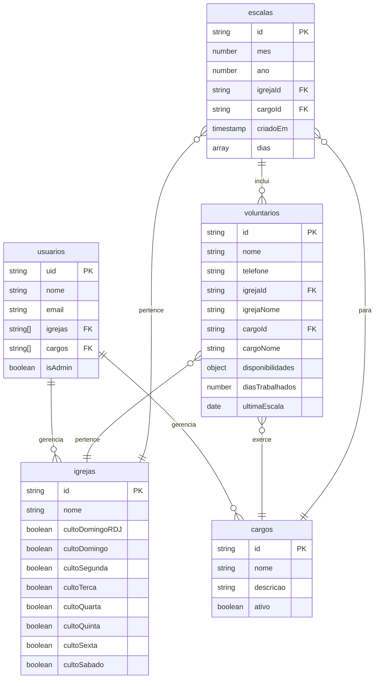

# Documentação do Schema Firebase - Sistema de Gestão de Voluntários

Este documento apresenta uma análise completa do schema do Firebase para o sistema de gestão de voluntários e escalas da igreja, incluindo estrutura das coleções, relacionamentos e requisitos de campos.

## Índice

- [Visão Geral do Sistema](#visão-geral-do-sistema)
- [Coleções](#coleções)
  - [usuarios](#usuarios)
  - [igrejas](#igrejas)
  - [cargos](#cargos)
  - [voluntarios](#voluntarios)
  - [escalas](#escalas)
- [Relacionamentos](#relacionamentos)
- [Diagrama de Relacionamentos](#diagrama-de-relacionamentos)

## Visão Geral do Sistema

O sistema gerencia voluntários, suas escalas de trabalho, igrejas e cargos. Os relacionamentos são estabelecidos através de IDs compartilhados e arrays de referências.

---

## Coleções

### `usuarios`

**Descrição**: Armazena informações dos usuários do sistema (administradores e usuários regulares).

#### Schema

```typescript
interface Usuario {
  uid: string;
  nome: string;
  email: string;
  igrejas: string[];
  cargos: string[];
  isAdmin: boolean;
}
```

#### Estrutura dos Campos

| Campo     | Tipo       | Obrigatório | Descrição                                             | Exemplo                  |
| --------- | ---------- | ----------- | ----------------------------------------------------- | ------------------------ |
| `uid`     | `string`   | ✅          | UID do Firebase Auth (usado como document ID)         | `"abc123def456"`         |
| `nome`    | `string`   | ✅          | Nome completo do usuário                              | `"João Silva"`           |
| `email`   | `string`   | ✅          | Email do usuário (único)                              | `"joao@email.com"`       |
| `igrejas` | `string[]` | ✅          | Array de IDs das igrejas que o usuário pode gerenciar | `["igreja1", "igreja2"]` |
| `cargos`  | `string[]` | ✅          | Array de IDs dos cargos que o usuário pode gerenciar  | `["cargo1", "cargo2"]`   |
| `isAdmin` | `boolean`  | ✅          | Indica se o usuário é administrador do sistema        | `true`                   |

#### Exemplo de Documento

```json
{
  "uid": "abc123def456",
  "nome": "João Silva",
  "email": "joao@email.com",
  "igrejas": ["igreja1", "igreja2"],
  "cargos": ["cargo1", "cargo2"],
  "isAdmin": false
}
```

#### Campos Obrigatórios vs Opcionais

- **Obrigatórios**: Todos os campos são obrigatórios
- **Critério**: Baseado na lógica de criação de usuários e validações no formulário

---

### `igrejas`

**Descrição**: Armazena informações das igrejas e seus horários de culto.

#### Schema

```typescript
interface Igreja {
  id: string;
  nome: string;
  cultoDomingoRDJ: boolean;
  cultoDomingo: boolean;
  cultoSegunda: boolean;
  cultoTerca: boolean;
  cultoQuarta: boolean;
  cultoQuinta: boolean;
  cultoSexta: boolean;
  cultoSabado: boolean;
}
```

#### Estrutura dos Campos

| Campo             | Tipo      | Obrigatório | Descrição                           | Exemplo            |
| ----------------- | --------- | ----------- | ----------------------------------- | ------------------ |
| `id`              | `string`  | ✅          | ID único da igreja (document ID)    | `"igreja1"`        |
| `nome`            | `string`  | ✅          | Nome da igreja                      | `"Igreja Central"` |
| `cultoDomingoRDJ` | `boolean` | ✅          | Indica se há culto no domingo RDJ   | `true`             |
| `cultoDomingo`    | `boolean` | ✅          | Indica se há culto no domingo       | `true`             |
| `cultoSegunda`    | `boolean` | ✅          | Indica se há culto na segunda-feira | `false`            |
| `cultoTerca`      | `boolean` | ✅          | Indica se há culto na terça-feira   | `false`            |
| `cultoQuarta`     | `boolean` | ✅          | Indica se há culto na quarta-feira  | `true`             |
| `cultoQuinta`     | `boolean` | ✅          | Indica se há culto na quinta-feira  | `false`            |
| `cultoSexta`      | `boolean` | ✅          | Indica se há culto na sexta-feira   | `true`             |
| `cultoSabado`     | `boolean` | ✅          | Indica se há culto no sábado        | `false`            |

#### Exemplo de Documento

```json
{
  "nome": "Igreja Central",
  "cultoDomingoRDJ": true,
  "cultoDomingo": true,
  "cultoSegunda": false,
  "cultoTerca": false,
  "cultoQuarta": true,
  "cultoQuinta": false,
  "cultoSexta": true,
  "cultoSabado": false
}
```

#### Campos Obrigatórios vs Opcionais

- **Obrigatórios**: Todos os campos são obrigatórios
- **Critério**: Necessários para determinação dos dias de culto e geração de escalas

---

### `cargos`

**Descrição**: Define os diferentes tipos de cargo/função que um voluntário pode exercer.

#### Schema

```typescript
interface Cargo {
  id: string;
  nome: string;
  descricao: string;
  ativo: boolean;
}
```

#### Estrutura dos Campos

| Campo       | Tipo      | Obrigatório | Descrição                               | Exemplo                                 |
| ----------- | --------- | ----------- | --------------------------------------- | --------------------------------------- |
| `id`        | `string`  | ✅          | ID único do cargo (document ID)         | `"cargo1"`                              |
| `nome`      | `string`  | ✅          | Nome do cargo                           | `"Porteiro"`                            |
| `descricao` | `string`  | ✅          | Descrição detalhada do cargo            | `"Responsável pela portaria da igreja"` |
| `ativo`     | `boolean` | ✅          | Indica se o cargo está ativo no sistema | `true`                                  |

#### Exemplo de Documento

```json
{
  "nome": "Porteiro",
  "descricao": "Responsável pela portaria da igreja",
  "ativo": true
}
```

#### Campos Obrigatórios vs Opcionais

- **Obrigatórios**: Todos os campos são obrigatórios
- **Critério**: Baseado na interface TypeScript e uso nos formulários

---

### `voluntarios`

**Descrição**: Armazena informações dos voluntários e suas disponibilidades.

#### Schema

```typescript
interface Voluntario {
  id: string;
  nome: string;
  telefone: string;
  igrejaId: string;
  igrejaNome: string;
  cargoId: string;
  cargoNome: string;
  disponibilidades?: {
    domingoRDJ: boolean;
    domingo: boolean;
    segunda: boolean;
    terca: boolean;
    quarta: boolean;
    quinta: boolean;
    sexta: boolean;
    sabado: boolean;
  };
  diasTrabalhados?: number;
  ultimaEscala?: Date;
}
```

#### Estrutura dos Campos

| Campo              | Tipo     | Obrigatório | Descrição                            | Exemplo             |
| ------------------ | -------- | ----------- | ------------------------------------ | ------------------- |
| `id`               | `string` | ✅          | ID único do voluntário (document ID) | `"vol1"`            |
| `nome`             | `string` | ✅          | Nome completo do voluntário          | `"Maria Santos"`    |
| `telefone`         | `string` | ✅          | Telefone do voluntário (formatado)   | `"(11) 99999-9999"` |
| `igrejaId`         | `string` | ✅          | ID da igreja à qual pertence         | `"igreja1"`         |
| `igrejaNome`       | `string` | ✅          | Nome da igreja (desnormalizado)      | `"Igreja Central"`  |
| `cargoId`          | `string` | ✅          | ID do cargo que exerce               | `"cargo1"`          |
| `cargoNome`        | `string` | ✅          | Nome do cargo (desnormalizado)       | `"Porteiro"`        |
| `disponibilidades` | `object` | ❌          | Dias da semana disponíveis           | Ver exemplo abaixo  |
| `diasTrabalhados`  | `number` | ❌          | Contador de dias trabalhados         | `5`                 |
| `ultimaEscala`     | `Date`   | ❌          | Data da última escala                | `2024-01-15`        |

#### Estrutura de Disponibilidades

```json
{
  "domingoRDJ": true,
  "domingo": false,
  "segunda": false,
  "terca": false,
  "quarta": true,
  "quinta": false,
  "sexta": true,
  "sabado": false
}
```

#### Exemplo de Documento

```json
{
  "nome": "Maria Santos",
  "telefone": "(11) 99999-9999",
  "igrejaId": "igreja1",
  "igrejaNome": "Igreja Central",
  "cargoId": "cargo1",
  "cargoNome": "Porteiro",
  "disponibilidades": {
    "domingoRDJ": true,
    "domingo": false,
    "segunda": false,
    "terca": false,
    "quarta": true,
    "quinta": false,
    "sexta": true,
    "sabado": false
  },
  "diasTrabalhados": 0,
  "ultimaEscala": null
}
```

#### Campos Obrigatórios vs Opcionais

- **Obrigatórios**: `nome`, `telefone`, `igrejaId`, `igrejaNome`, `cargoId`, `cargoNome`
- **Opcionais**: `disponibilidades`, `diasTrabalhados`, `ultimaEscala`
- **Critério**: Baseado na interface TypeScript (campos com `?`) e lógica de criação

---

### `escalas`

**Descrição**: Armazena as escalas mensais geradas para cada igreja e cargo.

#### Schema (Escalas Mensais)

```typescript
interface EscalaMensal {
  mes: number;
  ano: number;
  igrejaId: string;
  cargoId: string;
  criadoEm: Timestamp;
  dias: {
    data: Timestamp;
    tipoCulto: string;
    voluntarios: {
      id: string;
      nome: string;
    }[];
  }[];
}
```

#### Schema (Item Individual)

```typescript
interface EscalaItem {
  data: Date;
  voluntarios: {
    id: string;
    nome: string;
  }[];
  igrejaId: string;
  cargoId: string;
  tipoCulto: string;
}
```

#### Estrutura dos Campos (Escala Mensal)

| Campo      | Tipo        | Obrigatório | Descrição                | Exemplo              |
| ---------- | ----------- | ----------- | ------------------------ | -------------------- |
| `mes`      | `number`    | ✅          | Mês da escala (1-12)     | `3`                  |
| `ano`      | `number`    | ✅          | Ano da escala            | `2024`               |
| `igrejaId` | `string`    | ✅          | ID da igreja             | `"igreja1"`          |
| `cargoId`  | `string`    | ✅          | ID do cargo              | `"cargo1"`           |
| `criadoEm` | `Timestamp` | ✅          | Data/hora de criação     | `Timestamp`          |
| `dias`     | `array`     | ✅          | Array com os dias do mês | Ver estrutura abaixo |

#### Estrutura do Array `dias`

| Campo         | Tipo        | Obrigatório | Descrição              | Exemplo              |
| ------------- | ----------- | ----------- | ---------------------- | -------------------- |
| `data`        | `Timestamp` | ✅          | Data específica do dia | `Timestamp`          |
| `tipoCulto`   | `string`    | ✅          | Tipo de culto          | `"domingo"`          |
| `voluntarios` | `array`     | ✅          | Voluntários escalados  | Ver estrutura abaixo |

#### Estrutura do Array `voluntarios`

| Campo  | Tipo     | Obrigatório | Descrição          | Exemplo          |
| ------ | -------- | ----------- | ------------------ | ---------------- |
| `id`   | `string` | ✅          | ID do voluntário   | `"vol1"`         |
| `nome` | `string` | ✅          | Nome do voluntário | `"Maria Santos"` |

#### Tipos de Culto Válidos

- `"domingoRDJ"` - Domingo RDJ
- `"domingo"` - Domingo
- `"segunda"` - Segunda-feira
- `"terca"` - Terça-feira
- `"quarta"` - Quarta-feira
- `"quinta"` - Quinta-feira
- `"sexta"` - Sexta-feira
- `"sabado"` - Sábado

#### Exemplo de Documento

```json
{
  "mes": 3,
  "ano": 2024,
  "igrejaId": "igreja1",
  "cargoId": "cargo1",
  "criadoEm": "2024-02-28T10:00:00Z",
  "dias": [
    {
      "data": "2024-03-03T00:00:00Z",
      "tipoCulto": "domingo",
      "voluntarios": [
        {
          "id": "vol1",
          "nome": "Maria Santos"
        }
      ]
    }
  ]
}
```

#### Campos Obrigatórios vs Opcionais

- **Obrigatórios**: Todos os campos são obrigatórios
- **Critério**: Necessários para o funcionamento do sistema de escalas

---

## Relacionamentos

### Diagrama Conceitual

```
[usuarios] ←→ [igrejas] (many-to-many via array igrejas)
[usuarios] ←→ [cargos] (many-to-many via array cargos)
[voluntarios] → [igrejas] (many-to-one via igrejaId)
[voluntarios] → [cargos] (many-to-one via cargoId)
[escalas] → [igrejas] (many-to-one via igrejaId)
[escalas] → [cargos] (many-to-one via cargoId)
[escalas.dias.voluntarios] → [voluntarios] (many-to-many via id)
```

### Relacionamentos Detalhados

#### 1. **usuarios ↔ igrejas** (Many-to-Many)

- **Campo de ligação**: `usuarios.igrejas[]` (array de IDs)
- **Tipo**: Relacionamento implícito
- **Descrição**: Um usuário pode gerenciar múltiplas igrejas, e uma igreja pode ser gerenciada por múltiplos usuários
- **Implementação**: Array de strings contendo IDs das igrejas

#### 2. **usuarios ↔ cargos** (Many-to-Many)

- **Campo de ligação**: `usuarios.cargos[]` (array de IDs)
- **Tipo**: Relacionamento implícito
- **Descrição**: Um usuário pode gerenciar múltiplos cargos, e um cargo pode ser gerenciado por múltiplos usuários
- **Implementação**: Array de strings contendo IDs dos cargos

#### 3. **voluntarios → igrejas** (Many-to-One)

- **Campo de ligação**: `voluntarios.igrejaId`
- **Campo desnormalizado**: `voluntarios.igrejaNome`
- **Tipo**: Chave estrangeira
- **Descrição**: Cada voluntário pertence a uma igreja específica
- **Implementação**: String contendo o ID da igreja

#### 4. **voluntarios → cargos** (Many-to-One)

- **Campo de ligação**: `voluntarios.cargoId`
- **Campo desnormalizado**: `voluntarios.cargoNome`
- **Tipo**: Chave estrangeira
- **Descrição**: Cada voluntário exerce um cargo específico
- **Implementação**: String contendo o ID do cargo

#### 5. **escalas → igrejas** (Many-to-One)

- **Campo de ligação**: `escalas.igrejaId`
- **Tipo**: Chave estrangeira
- **Descrição**: Cada escala pertence a uma igreja específica
- **Implementação**: String contendo o ID da igreja

#### 6. **escalas → cargos** (Many-to-One)

- **Campo de ligação**: `escalas.cargoId`
- **Tipo**: Chave estrangeira
- **Descrição**: Cada escala é específica para um cargo
- **Implementação**: String contendo o ID do cargo

#### 7. **escalas.dias.voluntarios → voluntarios** (Many-to-Many)

- **Campo de ligação**: `escalas.dias[].voluntarios[].id`
- **Campo desnormalizado**: `escalas.dias[].voluntarios[].nome`
- **Tipo**: Array de referências
- **Descrição**: Cada dia de escala pode ter múltiplos voluntários, e cada voluntário pode estar em múltiplos dias
- **Implementação**: Array de objetos contendo ID e nome do voluntário

### Desnormalização de Dados

O sistema utiliza desnormalização estratégica para melhorar performance:

1. **voluntarios.igrejaNome**: Nome da igreja armazenado junto com o ID
2. **voluntarios.cargoNome**: Nome do cargo armazenado junto com o ID
3. **escalas.dias[].voluntarios[].nome**: Nome do voluntário armazenado junto com o ID

**Vantagens**:

- Reduz consultas adicionais ao Firebase
- Melhora performance de listagens
- Facilita exportação de relatórios

**Desvantagens**:

- Requer sincronização manual quando nomes são alterados
- Aumenta ligeiramente o tamanho dos documentos

---

## Diagrama de Relacionamentos



---

## Considerações de Design

### 1. **Segurança**

- IDs de documentos são gerados automaticamente pelo Firebase
- Relacionamentos baseados em IDs únicos
- Arrays de IDs para relacionamentos many-to-many

### 2. **Performance**

- Desnormalização estratégica para reduzir consultas
- Índices implícitos nos campos de relacionamento
- Consultas otimizadas com `where` clauses

### 3. **Manutenibilidade**

- Interfaces TypeScript garantem consistência
- Campos desnormalizados requerem sincronização
- Validações no frontend e regras no Firebase

### 4. **Escalabilidade**

- Estrutura permite crescimento horizontal
- Relacionamentos otimizados para consultas frequentes
- Flexibilidade para adição de novos campos

---

_Documentação gerada em: ${new Date().toLocaleDateString('pt-BR')}_
